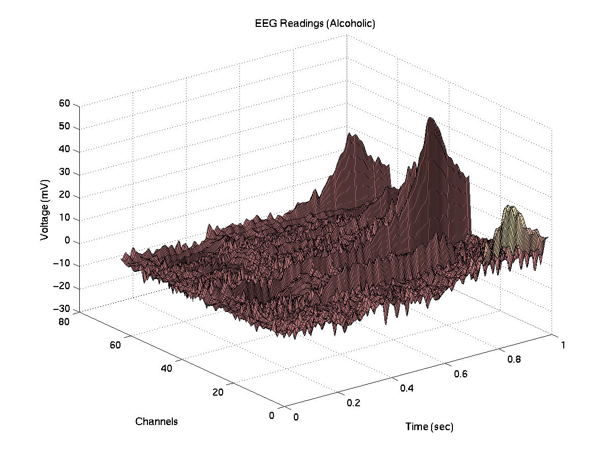

## Experience and dataset explanation

This data comes from a study on the EEG (electroencephalogram) patterns related to genetic predisposition to alcoholism. It includes measurements from 64 scalp electrodes, sampled at 256 Hz for 1 second. The study involved two groups: alcoholic and control subjects, exposed to either one (S1) or two (S1 and S2) picture stimuli. The stimuli could be either identical (matched) or different (non-matched).

There were 122 subjects, each completing 120 trials with various stimuli. The data follows standard electrode positions. You can find more details about the data collection process in Zhang et al. (1995). There are three versions of this EEG dataset available.

Electroencephalography (EEG) is commonly utilized in the fields of neuroscience, neural engineering, and biomedical engineering, including for brain-computer interfaces, sleep analysis, and seizure detection, due to its high temporal resolution, non-invasiveness, and relatively low cost. Automating the classification of EEG signals aims to make its use more practical and less dependent on experts. The typical EEG classification process includes artifact removal, feature extraction, and classification. At its core, an EEG dataset consists of a 2D (time and channel) matrix of real values, depicting potentials generated by the brain. This specific structure makes EEG suitable for machine learning. Many traditional methods, such as independent component analysis (ICA), have been applied, especially for artifact removal.

## State of the art

The dataset under consideration belongs to the Event Related Potentials (ERP) class within EEG studies. ERPs are brain responses triggered by specific sensory, cognitive, or motor events. They are usually observed when subjects undergo a visual presentation task where they view a rapid sequence of images or letters, directing their attention towards certain cues. The appearance of a specific cue typically elicits a recognizable EEG pattern, often seen as the P300 response. A notable advantage of ERP-focused research is the high clarity and signal-to-noise ratio of the data, presenting fewer artifacts than usual EEG recordings. This clear and precise data holds significant potential for advancing non-verbal EEG-based communication systems.
### Preprocessing 

Based on our research, EEG data often contains noise from unwanted signals, like those from muscle movements or eye blinks. While 41% of studies didn't specify their artifact removal method, the rest used manual removal (29%), automatic removal (8%), or no cleaning at all (22%). Surprisingly, 26 out of 90 studies opted for manual removal, which can be subjective and hard to replicate. In total, 63% didn't systematically remove EEG artifacts. Of those that did, the most common techniques were :

- **Independent component analysis (ICA)**
- **Discrete wavelet transformation (DWT)**

Many studies also applied frequency domain filters to focus on specific EEG bandwidths. It remains unclear if deep learning can effectively process unfiltered data without artifact removal.

**We choose to train our model without preprocessing**

### Format type

Studies categorized EEG input formulations into three types: 

- **Calculated features** (41%)
- **Images** (20%)
- **Signal values** (39%).

The choice depended on both the task and deep learning architecture. A variety of methods exist for feature extraction from EEG data, with the most common being power spectral density, wavelet decomposition, and basic statistical measures. Spectrograms, historically a visualization tool, have been employed as inputs for CNNs due to their prowess in image learning. Some studies use raw EEG signal strength in the time domain as direct input, endorsing the end-to-end learning philosophy. Task-specific preferences exist: emotion recognition, mental workload, and motor imagery tasks largely chose calculated features, while seizure detection, sleep stage scoring, and event-related potential analysis favored direct signal values.

**That's why we chose to use raw data to train our models.**

### Networks to handle ERP EEG 

There are various methods for handling ERP-type EEG data, including CNNs (Convolutional Neural Networks), DBNs (Deep Belief Networks), and SAEs (Stacked Autoencoders). However, CNNs have shown slightly superior performance, especially with raw data or image inputs.
**We choose CNN to perform the binary classification**

## Model

- **Input Layer**:
    
    - Input `x` is split into `x1` and `x2`.
    - `x1` is expanded to have an additional dimension using `unsqueeze`.
    - `x1` represents the raw data with 64 channel and 256 values per channel
    - `x2`represents the type object showed, can be S1 type or S2
    
- **Convolutional Layers**:
    
    - **Conv1**: 1 channel to 64 channels with kernel size (1, 16) and padding on the width.
    - DP + BN
    - **AvgPool**: Average pooling with kernel size (1,4).

    - **Conv2**: 64 channels to 128 channels with kernel size (64, 1). Groups are set to 64.
    -  DP + BN
    - **AvgPool**: Average pooling with kernel size (1,4).
        
    - **Conv3**: 128 channels to 256 channels with kernel size (1, 16) and padding on the width.
    - DP + BN
    - **AvgPool2**: Average pooling with kernel size (1,8).
        
- **Flatten Layer**
- **Concatenation**
    - Concatenate the flattened tensor `x1` with `x2`.
- **Linear Layers**:
    - **Lin1**: Linear transformation. Its input size is determined dynamically based on the size of the concatenated tensor. Outputs 64 units.
    - **Lin2**: Transforms from 64 units to 2 units.
- **Softmax**:
    - Softmax activation for classification output.

Loss : Cross Entropy
Optimizer : Adam
